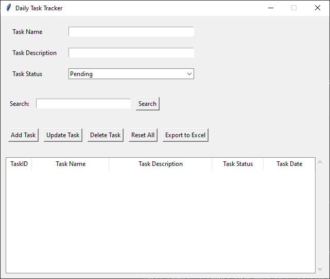

# Task Tracker Application



## Overview

The Task Tracker Application is a Python-based desktop application built using Tkinter and SQLite. It allows users to manage daily tasks efficiently by providing functionalities to add, delete, update, and view tasks. The application also supports exporting task data to Excel files for easy reporting and archiving.

## Features

- **Task Management**: Add, delete, update, and view tasks with detailed information such as task name, description, status, and date.
- **Sorting and Filtering**: Sort tasks by columns and filter tasks based on various criteria such as task status.
- **Excel Export**: Export task data to Excel files (.xlsx) for further analysis or reporting.
- **Responsive UI**: Designed to be user-friendly with responsive resizing and adaptive layout adjustments.

## Installation

1. Clone the repository:
   ```bash
   git clone https://github.com/yourusername/task-tracker.git
   cd task-tracker

2. Install the required dependencies:
   ```bash
   pip install -r requirements.txt

3. Run the application:
   ```bash
   python task_tracker.py

## Usage

- **Adding a Task**: Enter task details in the input fields and click "Add Task".
- **Deleting a Task**: Select a task from the list and click "Delete Task".
- **Updating a Task**: Select a task, modify details in the input fields, and click "Update Task".
- **Exporting to Excel**: Click "Export to Excel" to save task data as an Excel file in the current directory.
